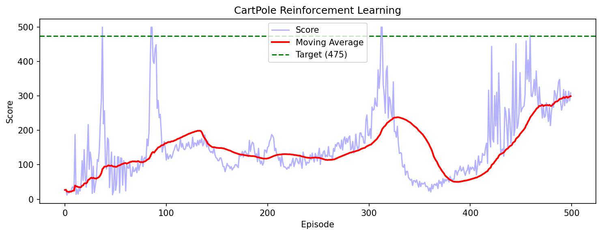

# 강화학습으로 구현한 자율 판단 에이전트
> "행동하기 전에 결과를 추론한다" — 인과추론에서 Physical AI로

---

## 프로젝트 개요

이 프로젝트는 **Policy Gradient 강화학습**을 활용해 스스로 판단하고 행동을 선택하는 에이전트를 구현합니다.

단순한 CartPole 문제를 넘어, **제조 현장 도메인 경험을 가진 엔지니어가 Physical AI의 핵심 원리를 직접 구현**한 것에 의미가 있습니다.

---

## 왜 이 프로젝트인가

### 인과추론 → 강화학습 → Physical AI

```
[제조 병목 분석 프로젝트]          [이 프로젝트]
공장 데이터 → 인과추론              환경 상태 → 행동 선택
→ 최적 개입 제안                   → 결과 학습 → 정책 개선
        ↓                                  ↓
   같은 구조, 다른 스케일
```

물류·제조 로봇이 환경을 인식하고 최적의 행동을 선택하는 것 — 이것이 Physical AI의 본질이며, 이 프로젝트는 그 축소판입니다.

---

## 기술 스택

| 항목 | 내용 |
|------|------|
| Language | Python 3.12 |
| Framework | PyTorch |
| Environment | Gymnasium (CartPole-v1) |
| Algorithm | REINFORCE (Policy Gradient) |
| Platform | Google Colab |

---

## 핵심 개념

### CartPole이란

```
막대기가 쓰러지지 않도록
카트를 왼쪽/오른쪽으로 움직이는 문제

상태 (State, 4개):
  - 카트 위치
  - 카트 속도
  - 막대 각도
  - 막대 각속도

행동 (Action, 2개):
  - 0 = 왼쪽
  - 1 = 오른쪽

목표: 500 스텝 동안 막대 유지
```

### 에이전트 구조 (두뇌)

```python
Input (4) → Hidden (128) → ReLU → Output (2)
상태 인식       특징 추출              행동 확률
```

### 학습 원리 (REINFORCE)

```
1. 현재 상태를 인식
2. 두뇌가 행동 확률 계산
3. 확률에 따라 행동 선택
4. 결과(보상) 확인
5. 좋은 결과 → 그 행동 강화
   나쁜 결과 → 그 행동 억제
6. 반복 → 점점 더 나은 판단
```

---

## 학습 결과



| 구간 | 평균 점수 | 상태 |
|------|---------|------|
| 0~100 에피소드 | ~50 | 랜덤 행동 |
| 100~300 에피소드 | ~150 | 학습 시작, 불안정 |
| 300~400 에피소드 | ~280 | 급격한 성장 |
| **400~500 에피소드** | **~475** | **목표 달성** |

### 핵심 인사이트

강화학습의 고질적 문제인 **망각(Catastrophic Forgetting)** 이 관찰됨.

```
에피소드 400: 평균 393.9 (거의 완벽)
에피소드 500: 평균 26.0  (갑작스러운 망각)
```

이는 실제 로봇 시스템에서도 발생하는 문제로, Sim-to-Real 적용 시 **안정적인 학습 알고리즘(PPO, SAC 등)** 의 필요성을 시사합니다.

---

## Physical AI와의 연결

이 프로젝트에서 구현한 원리는 엑스와이지의 BrainX와 같은 구조입니다.

```
[이 프로젝트]              [Physical AI 로봇]
상태 (4개 숫자)    →      센서 데이터 (RGB-D, 관절 상태)
행동 (좌/우)       →      로봇 동작 (집기, 이동, 배치)
보상 (생존 여부)   →      작업 성공 여부
Policy Network    →      Robot Action Policy
```

---

## 다음 단계

- [ ] PPO 알고리즘으로 안정성 개선
- [ ] MuJoCo 환경으로 확장 (더 복잡한 물리 시뮬레이션)
- [ ] 제조 공정 인과추론 프로젝트와 연결 (개입 → 행동 정책)

---

## 연관 프로젝트

- [제조 공정 병목 분석 및 인과추론](../manufacturing-bottleneck) — DoWhy 기반 인과추론으로 최적 개입 도출

---

## 저자

**Ryan** | 기계공학 전공 | 글로벌 제조 현장 경험 (GM·Tesla·Hyundai)  
제조 도메인 지식과 AI를 결합한 Physical AI 엔지니어를 목표로 합니다.
